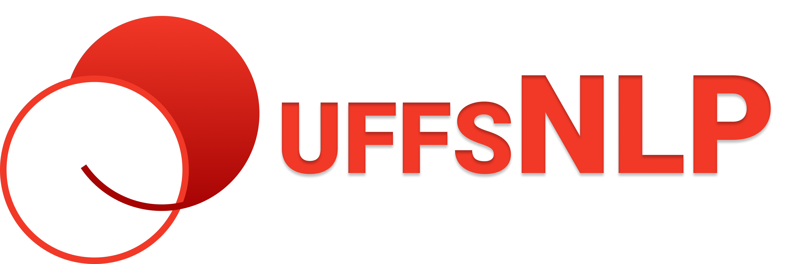

<p align="center">
    <br />
</p>

<p align="left">
    
    
    <a href="https://www.gatsbyjs.com/"></a>
</p>

# Site do Grupo de Estudos UFFSNLP

<!-- O que é / Justificativa -->
O grupo de estudos em Processamento de Linguagem Natural (NLP, do inglês _Natural Language Processing_) da Universidade Federal da Fronteira Sul tem como intuito ampliar o horizonte de possibilidades de pesquisa e inovação da comunidade acadêmica na área (para mais informações sobre o grupo verifique [este link](/sobre)). Este repositório mantém o código do site do grupo de estudos.

## Como rodar o projeto

_Este projeto utiliza a biblioteca [Gatsby.js](https://www.gatsbyjs.com), portanto você deverá tê-la instalada para que o projeto seja executado com êxito (instruções para concluir esta etapa podem ser econtradas na [documentação oficial](https://www.gatsbyjs.com/docs/tutorial/part-zero/))._

Primeiro, clone o repositório e entre no respectivo diretório:

```
git clone https://github.com/uffsnlp/uffsnlp.github.io.git
cd uffsnlp.github.io
```

Em seguida instale as dependências:

```
npm install
```

Agora é só rodar:

```
npm start
```
**ou**
```
gatsby develop
```

## Como contribuir

Sua ajuda é muito bem-vinda!! Confira o arquivo [CONTRIBUTING.md](CONTRIBUTING.md) para saber como fazê-lo. Em suma, basta seguir os seguintes passos:

1. Selecione uma [issue](/issues);
2. Resolva ela;
3. Crie uma pull request;
4. Repita!!
